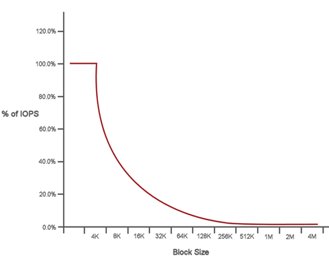

= Quality of Service
:icons: font
:imagesdir: ../media/

[.lead]
A SolidFire storage cluster has the ability to provide Quality of Service (QoS) parameters on a per-volume basis. You can guarantee cluster performance measured in inputs and outputs per second (IOPS) using three configurable parameters that define QoS: Min IOPS, Max IOPS, and Burst IOPS.

NOTE: SolidFire Active IQ has a QoS recommendations page that provides advice on optimal configuration and set up of QoS settings.

IOPS parameters are defined in the following ways:

* *Minimum IOPS*
+
The minimum number of sustained inputs and outputs per second (IOPS) that the storage cluster provides to a volume. The Min IOPS configured for a volume is the guaranteed level of performance for a volume. Performance does not drop below this level.

* *Maximum IOPS*
+
The maximum number of sustained IOPS that the storage cluster provides to a volume. When cluster IOPS levels are critically high, this level of IOPS performance is not exceeded.

* *Burst IOPS*
+
The maximum number of IOPS allowed in a short burst scenario. If a volume has been running below the Max IOPS, burst credits are accumulated. When performance levels become very high and are pushed to maximum levels, short bursts of IOPS are allowed on the volume.
+
Element software uses Burst IOPS when a cluster is running in a state of low cluster IOPS utilization.
+
A single volume can accrue Burst IOPS and use the credits to burst above their Max IOPS up to their Burst IOPS level for a set "burst period". A volume can burst for up to 60 seconds if the cluster has the capacity to accommodate the burst.
+
A volume accrues one second of burst credit (up to a maximum of 60 seconds) for every second that the volume runs below its Max IOPS limit.
+
Burst IOPS are limited in two ways:

 ** A volume can burst above its Max IOPS for a number of seconds equal to the number of burst credits that the volume has accrued.
 ** When a volume bursts above its Max IOPS setting, it is limited by its Burst IOPS setting. Therefore, the burst IOPS never exceeds the burst IOPS setting for the volume.

* *Effective Max Bandwidth*
+
The maximum bandwidth is calculated by multiplying the number of IOPS (based on the QoS curve) by the IO size.
+
Example:
+
QoS parameter settings of 100 Min IOPS, 1000 Max IOPS, and 1500 Burst IOPs have the following effects on quality of performance:

 ** Workloads are able to reach and sustain a maximum of 1000 IOPS until the condition of workload contention for IOPS becomes apparent on the cluster. IOPS are then reduced incrementally until IOPS on all volumes are within the designated QoS ranges and contention for performance is relieved.
 ** Performance on all volumes is pushed toward the Min IOPS of 100. Levels do not drop below the Min IOPS setting but could remain higher than 100 IOPS when workload contention is relieved.
 ** Performance is never greater than 1000 IOPS, or less than 100 IOPS for a sustained period. Performance of 1500 IOPS (Burst IOPS) is allowed, but only for those volumes that have accrued burst credits by running below Max IOPS and only allowed for a short periods of time. Burst levels are never sustained.

== QoS value limits

You can find information about the possible minimum and maximum values for Quality of Service (QoS).

|===
|  | I/O size maximum value
| Parameters| Minimum value| Default| 4KB| 8KB| 16KB| 262KB
a|
Min IOPS
a|
50
a|
50
a|
15,000
a|
9,375*
a|
5556*
a|
385*
a|
Max IOPS
a|
100
a|
15,000
a|
200,000**
a|
125,000
a|
74,074
a|
5128
a|
Burst IOPS
a|
100
a|
15,000
a|
200,000**
a|
125,000
a|
74,074
a|
5128
a|
*These estimations are approximate.**Max IOPS and Burst IOPS can be set as high as 200,000; however, this setting is allowed only to effectively uncap the performance of a volume. Real-world maximum performance of a volume is limited by cluster usage and per-node performance.

|===

== QoS performance curve

The Quality of Service (QoS) performance curve shows the relationship between block size and the percentage of IOPS.

Block size and bandwidth have a direct impact on the number of IOPS that an application can obtain. Element software takes into account the block sizes it receives by normalizing block sizes to 4k. Based on workload, the system might increase block sizes. As block sizes increase, the system increases bandwidth to a level necessary to process the larger block sizes. As bandwidth increases the number of IOPS the system is able to attain decreases.

The QoS performance curve shows the relationship between increasing block sizes and the decreasing percentage of IOPS:

As an example, if block sizes are 4k, and bandwidth is 4000 KBps, the IOPS are 1000. If block sizes increase to 8k, bandwidth increases to 5000 KBps, and IOPS decrease to 625. By taking block size into account, the system ensures that lower priority workloads that use higher block sizes, such as backups and hypervisor activities, do not take too much of the performance needed by higher priority traffic using smaller block sizes.

== Find more information
 * https://www.netapp.com/data-storage/solidfire/documentation[SolidFire and Element Resources page^]
