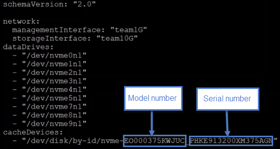

= Replace a cache drive in a SolidFire eSDS cluster
:icons: font
:imagesdir: ../media/

[.lead]
Perform this procedure if you want to replace the cache drive in your SolidFire eSDS cluster. The cache drive is associated with metadata services. The Element UI *Cluster* > *Drives* page shows the drive wear information.

* From the NetApp Element software UI, ensure that your cluster is in good health and there are no warnings or cluster faults. You can access the Element UI by using the management virtual IP (MVIP) address of the primary cluster node.
* Ensure that there are no active jobs running on the cluster.
* Ensure that you have familiarized yourself with all the steps.
* Ensure that you remove metadata services from the Element UI.
* Ensure that you take necessary precautions to prevent electrostatic discharge (ESD) while handling drives. See https://docs.netapp.com/sfe-122/index.jsp?topic=%2Fcom.netapp.doc.sfe-ssdrepl%2FGUID-E2FDD1C4-5025-4143-B7A3-5318CC8EAE79.html[Rules for handling drives].

. Perform the following steps in the Element UI:
 .. In the Element UI, click *Cluster* > *Nodes* > *Active*.
 .. Make a note of the node ID and management IP address of the node in which you are replacing the cache drive.
 .. If the cache drive is healthy and you are proactively replacing it, click *Active Drives*, locate the metadata drive, and remove it from the UI.
+
After you remove it, the metadata drive goes to *Removing* state first, and then to *Available*.

 .. If you are performing replacement after the cache drive failed, the metadata drive will be in *Available* state, and listed under *Cluster* > *Drives* > *Available*.
 .. In the Element UI, click *Cluster* > *Drives* > *Active*.
 .. Select the drive that you want to replace.
 .. Make a note of the serial number of the drive. This will help you locate the corresponding BayID in the IPMI interface of the node (HPE Integrated Lights-Out or iLO, in this case).
 .. Click *Bulk Actions* > *Remove*. After you remove the drive, the drive goes into the *Removing* state. It stays in the *Removing* state for a while, waiting for the data on the drive to be synced or redistributed to the remaining drives in the cluster. After the remove is complete, the drive moves to the *Available* state.
. Perform the following steps to locate the drive slot of the cache drive that you are replacing:
 .. Log in to the IPMI interface of the node (iLO in this case).
 .. Click *System Information* from the left-hand navigation and click *Storage*.
 .. Locate the cache drive.
+
NOTE: Cache drives will be of lesser capacity than storage drives.

 .. Match the serial number you made a note of in the previous step with what you see on the screen.
 .. Look for the slot number listed against the serial number. This is the physical slot from which you must remove the drive.
. Now that you have identified the drive, physically remove it as follows:
 .. Identify the drive bay.
+
The following image shows the front of the server with the drive bay numbering shown on the left side of the image:
+
image::../media/esds_drive_bay.png[]

 .. Press the power button on the drive that you want to replace. The LED blinks for 5-10 seconds and stops.
 .. After the LED stops blinking and the drive is powered off, remove it from the server by pressing the red button and pulling the latch.
+
NOTE: Ensure that you handle drives very carefully.
+
After you physically remove the drive, the drive state changes to *Failed* in the Element UI.
. In the Element UI, click *Cluster* > *Drives* > *Failed*.
. Click the icon under *Actions* and select *Remove*.
+
Now you can go ahead and install the new drive in the node.

. Make a note of the HPE model number and the ISN (serial number) of the new drive.
. Insert the replacement drive by carefully pushing the drive into the bay using the latch and closing the latch. The drive powers on when inserted correctly.
. Perform the following steps to verify the new drive details in iLO:
 .. Log in to iLO.
 .. Click *Information* > *Integrated Management Log*. You will see an event logged for the drive that you added.
 .. Click *System Information* from the left-hand navigation and click *Storage*.
 .. Scroll till you find information about the bay that you replaced the drive in.
 .. Verify that the serial number on your screen matches the serial number of the new drive that you installed.
. Add the new cache drive information in the sf_sds_config.yaml file for the node in which you replaced the drive.
+
The sf_sds_config.yamlfile is stored in /opt/sf/. This file includes all the information about the drives in the node. Every time you replace a drive, you must enter the replacement drive information in this file. For more information about this file, see xref:reference_esds_sf_sds_config_file.adoc[Contents of the sf_sds_config.yaml file].

 .. Establish an SSH connection to the node by using PuTTY.
 .. In the PuTTY configuration window, enter node MIP address (that you made a note of from the Element UI earlier) in the *Host Name (or IP address)* field.
 .. Click *Open*.
 .. In the terminal window that opens, log in with your username and password.
 .. Run the nvme list command to list the NMVe devices.
+
You will be able to see the model number and serial number of the new cache drive. See the following sample output:
+
image::../media/esds_nvme_list.png[]

 .. Add the new cache drive information in /opt/sf/sf_sds_config.yaml.
+
You should replace the existing cache drive model number and serial number with the corresponding information for the new cache drive. See the following example:
+

 .. Save the /opt/sf/sf_sds_config.yaml file.
 .. Reboot the node.
+
After the node reboots, you can verify that the SolidFire services are running by logging in to the node (using PuTTY), and running the system status solidfire command.

. In the Element UI, click *Cluster* > *Drives* > *Available*.
. Click the icon under *Actions* and select *Add*.
. Refresh your Element UI after the block sync job completes. You will see that the alert about the drive available has cleared if you access the *Running Tasks* page from the *Reporting* tab of the UI.
