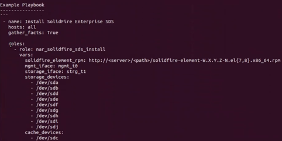

= Install SolidFire eSDS using Ansible
:icons: font
:imagesdir: ../media/

[.lead]
You can install SolidFire eSDS using an automation tool, such as Ansible. If you are very familiar with Ansible, you can create one Ansible playbook that combines several tasks, such as installing SolidFire eSDS and creating a cluster.

.What you'll need

* You have installed Ansible on your local server by following the instructions provided https://docs.ansible.com/ansible/latest/installation_guide/intro_installation.html#installation-guide[here^].
* You have familiarized yourself with Ansible roles. See https://docs.ansible.com/ansible/latest/user_guide/playbooks_reuse_roles.html[here^].
* You have performed all the prerequisite tasks listed link:concept_esds_prerequisite_tasks.html[here^].
* You have run a compliance check for SolidFire eSDS. For instructions on how to run the compliance check, see link:concept_esds_prerequisite_tasks.html[here^].

.About this task

Use Ansible Vault for sensitive information, such as passwords rather than using plain text. For more information, see the following links:
 ** https://docs.ansible.com/ansible/latest/user_guide/playbooks_vault.html[Using Ansible Vault]
 ** https://docs.ansible.com/ansible/latest/user_guide/intro_inventory.html[How to build your inventory]

IMPORTANT: You should specify all the required variables in your inventory file and not in the playbook.

.Steps

. Run the ansible-galaxy command to install all the roles relevant to SolidFire eSDS provided by NetApp.
+
The install role is *nar_solidfire_sds_install* and will be installed when you run the following command:
+
----
 $  ansible-galaxy install git+https://github.com/netapp/ansible.git
 - extracting ansible to ~/.ansible/roles/ansible
 - ansible was installed successfully
----
+
You can also manually install the role by copying it from the NetApp GitHub repository and placing the role in the `~/.ansible/roles` directory. NetApp provides a README file, which includes information about how to run a role.
+
NOTE: Ensure that you always download the latest versions of the roles.

. Move the roles that you downloaded up one directory from where they were installed.
+
----
 $ mv ~/.ansible/roles/ansible/nar_solidfire_sds_* ~/.ansible/roles/
----
. Run the `ansible-galaxy role list` command to ensure that Ansible is configured to utilize the new roles.
+
----
 $ ansible-galaxy role list
 # ~/.ansible/roles
 - nar_solidfire_sds_install, (unknown version)
 - nar_solidfire_sds_upgrade, (unknown version)
 - ansible, (unknown version)
 - nar_solidfire_sds_compliance, (unknown version)
----
+
NOTE: The README file associated with roles includes a list of all the required and optional variables that you should define as shown below:
+

+
You should define these variables in the inventory file, which you will create in the next step.

. Create the inventory file in your Ansible working directory.
+
TIP: In the inventory file, you should include all the hosts (nodes) on which you want to install SolidFire eSDS. The inventory file enables the playbook (which you will create in the next step) to manage multiple hosts with a single command. You should also define variables, such as username and password for your storage nodes, names of the management interface and storage interface, and so on.
+
[IMPORTANT]
====
Ensure that you follow these guidelines for the inventory file:

 ** Use the correct spellings for device names.
 ** Use correct formatting in the file.
 ** Ensure that there is only one cacheDevice.
 ** Use a list to specify storage_devices.
====
+
A sample inventory file is shown below. It includes four storage nodes. In this example, replace *storage node MIP* with the MIP addresses for your storage nodes and replace ****** with the username and password for your storage nodes.
+
----

all:
    hosts:
        storage node MIP:
        storage node MIP:
        storage node MIP:
        storage node MIP:
    vars:
        ansible_connection: ssh
        ansible_ssh_common_args: -o StrictHostKeyChecking=no
        ansible_user: *****
        ansible_ssh_pass: *****
        solidfire_element_rpm: http://sf-artifactory.solidfire.net/artifactory/crux/solidfire-element-**.*.*.***-*.***.x86_64.rpm
        mgmt_iface: "team0"
        storage_iface: "team1"
        storage_devices:
          - "/dev/nvme0n1"
          - "/dev/nvme1n1"
          - "/dev/nvme2n1"
          - "/dev/nvme3n1"
          - "/dev/nvme4n1"
          - "/dev/nvme5n1"
          - "/dev/nvme6n1"
          - "/dev/nvme7n1"
          - "/dev/nvme8n1"
        cache_devices:
          - "/dev/nvme9n1"
----

. Ping the hosts (nodes) you defined in the inventory file to verify that Ansible can communicate with them.
. Download the Red Hat Package Manager (RPM) file to the file directory on a local web server accessible from the server running Ansible and the storage nodes.
. Create the Ansible playbook. If you already have a playbook, you can modify it. You can use the examples in the README file that NetApp provides.
+
You should use `/dev/disk/by-id/nvme-<DriveModel>_<SerialNo>` for the cache device instead of /dev/nvme*n1 names. You can replace NVME raw names with by-id by specifying the following in your playbook:
+
----

    post_tasks:
    - name: Find the supported cache device's by-id path
      set_fact:
        found_device: "/dev/disk/by-id/{{ cdev_info.value['links']['ids'][0] }}"
      with_dict: "{{ ansible_devices }}"
      loop_control:
        loop_var: cdev_info
      when: cdev_info.value['model'] and cdev_info.value['model'].startswith('EO000')
      delegate_to: localhost    - fail:
        msg: "Error: Unable to locate Cache Device on this node!!!"
      when: not found_device or 'EO000' not in found_device    - set_fact:
        cache_devices: ['{{ found_device }}']
      when: cache_devices is defined and cache_devices|length > 0    - name: Update SolidFire eSDS configuration
      include_role:
        name: nar_solidfire_sds_install
        tasks_from: update-config.yml
      vars:
        cache_devices: ['{{ found_device }}']
----
. Install SolidFire eSDS by running the playbook you created in the previous step:
+
----
 $ ansible-playbook -i inventory.yaml sample_playbook.yaml
----
+
Replace *sample_playbook.yaml* with the name of your playbook and *inventory.yaml* with the name of your inventory file.
Running the playbook creates the `sf_sds_config.yaml` file on each node that is listed in your inventory file. It also installs and starts the SolidFire service on each storage node. For more information about `sf_sds_config.yaml`, see <insert link to ref topic.>

. Check the Ansible output in the console to ensure that the SolidFire service was started on each node.
+
Here is a sample output:
+
----

TASK [nar_solidfire_sds_install : Ensure the SolidFire eSDS service is started] *********************************************************************************************

changed: [10.61.68.52]

changed: [10.61.68.54]

changed: [10.61.68.51]

changed: [10.61.68.53]

PLAY RECAP ******************************************************************************************************************************************************************

10.61.68.51                : ok=12   changed=3    unreachable=0
failed=0    skipped=10   rescued=0    ignored=0

10.61.68.52                : ok=12   changed=3    unreachable=0
failed=0    skipped=10   rescued=0    ignored=0

10.61.68.53                : ok=12   changed=3    unreachable=0
failed=0    skipped=10   rescued=0    ignored=0

10.61.68.54                : ok=12   changed=3    unreachable=0
failed=0    skipped=10   rescued=0    ignored=0
----

. To verify that the SolidFire service was started correctly, run the `systemctl status solidfire` command, and check for `Active:active (exited)...` in the output.
