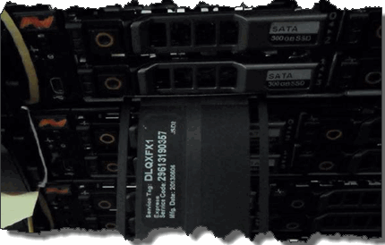

= Replacing a SolidFire chassis
:icons: font
:imagesdir: ../media/

[.lead]
You might need to replace the chassis if the fan, central processing unit (CPU), or dual inline memory module (DIMM) fails, or to fix overheating issues or problems with the boot process. Cluster faults in the NetApp Element software user interface (UI) and the blinking amber light in the front of the chassis are indications of a possible need for chassis replacement. You must contact NetApp Support before you proceed.

* You have contacted NetApp Support.
+
If you are ordering a replacement, you must have a case opened with NetApp Support.

* You have obtained the replacement chassis.
* You have an electrostatic discharge (ESD) wristband, or you have taken other antistatic protection.
* If you need to perform the Return to Factory Image (RTFI) process, you have obtained the USB key.
+
NetApp Support will help you decide if RTFI is needed. See NetApp Knowledge Base article.
+
https://kb.netapp.com/Advice_and_Troubleshooting/Hybrid_Cloud_Infrastructure/NetApp_HCI/How_to_create_an_RTFI_key_to_re-image_a_SolidFire_storage_node[Create an RTFI key]

* You have a keyboard and monitor.

The instructions in this document apply if you have a one-rack unit (1U) chassis with any of the following storage and Fibre Channel models:

* SF2405
* SF3010
* SF4805
* SF6010
* SF9605
* SF9608
* SF9010
* SF19210
* SF38410
* SF-FCN-01
* FC0025

. Locate the service tag of the failed chassis and verify that the serial number matches the number on the case you opened with NetApp Support when you ordered the replacement.
+
You can locate the service tag from the front of the chassis.
+
The following figure is an example of the service tag:
+

+
NOTE: The above figure is an example. The exact location of the service tag might vary depending on your hardware model.

. Plug in the keyboard and monitor to the back of the failed chassis.
. Verify chassis information with NetApp Support.
. Power down the chassis.
. Label the drives in the front of the chassis and cables at the back.
+
NOTE: Fibre Channel nodes do not have drives in the front.

. Remove the power supply units and cables.
. Remove the drives carefully, and place them on an antistatic, level surface.
+
NOTE: If you have a Fibre Channel node, you can skip this step.

. Remove the chassis by pressing the latch or unscrewing the thumbscrew, based on your hardware model.
+
You must package and return the failed chassis to NetApp.

. Remove the rails and install the new rails that were shipped with your replacement chassis.
+
You can choose to reuse the existing rails. If you are reusing the existing rails, you can skip this step.

. Slide the replacement chassis on to the rails.
. For storage nodes, insert the drives from the failed chassis to the replacement chassis.
+
NOTE: You must insert the drives in the same slots as they were in the failed chassis.

. Install the power supply units.
. Insert the power supply cables, and the 1GbE and 10GbE cables in their original ports.
+
Small form-factor pluggable (SFP) transceivers might be inserted in the 10GbE ports of the replacement chassis. You should remove them before you cable the 10GbE ports.

. If you have determined that you do not need to perform the RTFI process on the node, boot the node, and wait until the terminal user interface (TUI) appears. Proceed to step 16 and allow the cluster to re-image the node automatically when you add it by using the UI.
. If NetApp Support recommends re-imaging the node with a USB key, perform the following substeps:
 .. Power on the chassis. It boots with the RTFI key image.
 .. At the first prompt, type *Y* to image the storage node.
 .. At the second prompt, type *N* for hardware health checks.
+
If the RTFI script detects a problem with a hardware component, it displays an error in the console. If you see an error, contact NetApp Support. After the RTFI process completes, the node shuts down.

 .. Remove the USB key from the USB slot.
 .. Boot the newly imaged node, and wait for the TUI to appear.
. Configure the network and cluster information from the TUI.
+
The _NetApp Element Software User Guide_ provides instructions for configuration. You can also contact NetApp Support for assistance.

. Add the new node to the cluster using the cluster TUI.
. Pack and return the failed chassis.
+
NetApp Support will provide the return shipping label.
