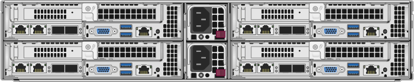

= Replace H410S node in a SolidFire Cluster
:icons: font
:imagesdir: ../media/

[.lead]
You must replace a storage node in the event of CPU failure, Radian card problems, other motherboard issues, or if it does not power on. The instructions apply to H410S storage nodes.

* You have verified that your storage node has failed.
* You have a replacement storage node.
* You have an electrostatic discharge (ESD) wristband, or you have taken other antistatic protection.
* You have labeled each cable that is connected to the storage node.

Alarms in the NetApp Element Software UI alert you when a storage node fails. You must use the NetApp Element software UI to get the serial number (service tag) of the failed node. You need this information to locate the failed node in the cluster.

The following figure shows the back of a two rack unit (2U), four-node chassis with four storage nodes:

