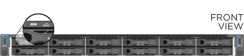

= Install the hardware
:icons: font
:imagesdir: ../media/

[.lead]
You must install your system in a four-post rack or cabinet, as applicable.

Steps 1 and 2 do not apply if you are adding a new node to an existing two rack unit (2U), four-node chassis.

. Install the rails in a four-post rack or cabinet.
. Install the chassis.
+
IMPORTANT: Use caution while lifting the hardware and installing it into the rack.

 ** An empty two rack unit (2U), four-node chassis weighs 54.45 lb (24.7 kg) and a node weighs 8.0 lb (3.6 kg).
 ** An H610S chassis weighs 40.5 lb (18.4 kg).
*Note:* If you are installing H610S nodes, you can skip steps 3 and 4.

. Install H410S nodes in the chassis.
+
The following figure is an example of a chassis with four nodes installed:
+
image::../media/sf_isi_chassis_rear.png[This figure shows the back of a 2U, four-node chassis with the nodes called out.]

. Install drives.
+
image::../media/hci_stor_node_ssd_bays.gif[This figure shows the front of the 2U, four-node chassis with the drive bays called out.]
+
|===
a|
image:../media/legend_icon_01.gif[]
a|
Six drives for each storage node in a four-node storage chassis.
|===

. Cable the storage nodes.
+
IMPORTANT: If the airflow vents at the rear of the chassis are blocked by cables or labels, it can lead to premature component failures due to overheating.

 ** Cable configuration for H410S storage node:
+
image::../media/hci_isi_storage_cabling.png[This figure shows the cabling of an H410S storage node.]

  *** Connect two CAT5e or higher cables in ports A and B for management connectivity.
  *** Connect two SFP28/SFP+ cables or transceivers in ports C and D for storage connectivity.
  *** (Optional, recommended) connect a CAT5e cable in the IPMI port for out-of-band management connectivity.

 ** Cable configuration for H610S storage node:
+
image::../media/h600s_isi_noderear.png[This figure shows the cabling of the H610S storage node.]

  *** Connect the node to a 10/25GbE network using two SFP28 or SFP+ cables.
  *** Connect the node to a 1GbE network using two RJ45 connectors.
  *** Connect the node to a 1GbE network using an RJ-45 connector in the IPMI port.
  *** Connect both power cables to the node.

. Connect the power cords to the two power supply units per chassis and plug them into 240V PDU or power outlet.
+
NOTE: This step applies only to H410S nodes installed in a 2U, four-node chassis. This step does not apply if you are adding a new node to an existing chassis.

. Power on the nodes.
 ** H410S nodes: It takes approximately six minutes for the node to boot.
+
image::../media/hci_poweron_isg.gif[This figure shows the power buttons on the nodes in the 2U, four-node chassis.]

 ** H610S nodes: It takes approximately five minutes and 30 seconds for the node to boot.
+

