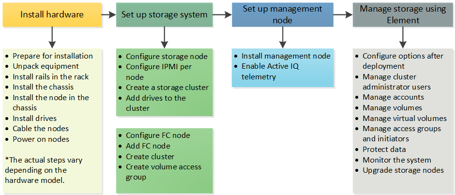

= Setup overview
:icons: font
:imagesdir: ../media/

[.lead]
Before you get started, you might want to understand the sequence of setting up NetApp Element software.

At this point, you should have already installed the hardware. Installing the hardware also includes Element software.

You'll need to set up the storage system for your environment.

.Steps

. link:../setup/concept_setup_configure_a_storage_node.html[Configure storage nodes]
. link:../setup/task_setup_create_a_storage_cluster.html[Create a storage cluster]
. link:../setup/task_post_deploy_access_the_element_software_user_interface.html[Access the Element UI]
. link:../setup/task_setup_add_drives_to_a_cluster.html[Add drives to the cluster]
. link:../setup/task_setup_change_the_garbage_collection_constant.html[Change garbage collection constant]
. link:../setup/concept_setup_fc_configure_a_fibre_channel_node.html[Configure a fibre channel node]
. link:..setup/task_setup_gh_redirect_set_up_a_management_node.html[Set up a management node]
. link:../setup/task_setup_configure_fqdn_web_ui_access.html[Configure Fully Qualified Domain Name web UI access]

== Find more information
* https://www.netapp.com/data-storage/solidfire/documentation[SolidFire and Element Resources page^]
